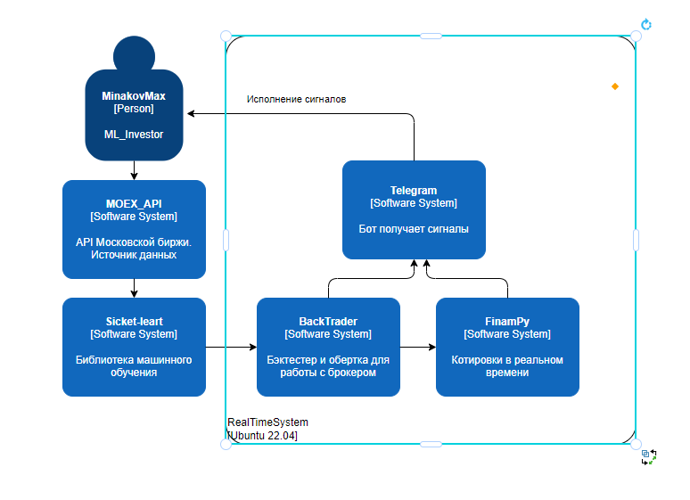

# Курсовой проект по дисциплине "ML System Design"
## Тема: Применение методов машинного обучения для прогнозирования цен акций Сбербанка

### HLD 


### Описание
Проект разработан для демонстрации возможностей машинного обучения в анализе и прогнозировании финансовых рынков на примере акций Сбербанка. Используя данные Московской Биржи и алгоритм логистической регрессии, реализованный через библиотеку `sklearn`, проект предоставляет аналитику и тестирование торговой стратегии.

### Особенности проекта
- **Аналитика данных**: Использование Jupyter Notebook (`sbrfimoexapi.ipynb`) для анализа и визуализации данных.
- **Торговая стратегия**: Применение модели логистической регрессии для формирования торговых сигналов.
- **Интеграция с брокером**: Возможность совершения сделок через брокера Finam на основе сигналов модели.
- **Уведомления через Telegram**: Автоматическая отправка уведомлений о состоянии торговых позиций через телеграм-бот.

### Docker контейнер
Проект упакован в Docker контейнер, что обеспечивает легкость развертывания и исполнения. Dockerfile настроен для сборки и запуска проекта в изолированной среде с предустановленными зависимостями.

### Запуск проекта
Для запуска проекта используйте следующие команды:
```bash
docker build \
  --build-arg API_KEY=${API_KEY} \
  --build-arg CLIENT_CODE=${CLIENT_CODE} \
  --build-arg TELEBOT_KEY=${TELEBOT_KEY} \
  -t your_image_name .
docker run -d --name sbrf-model sbrf-predict